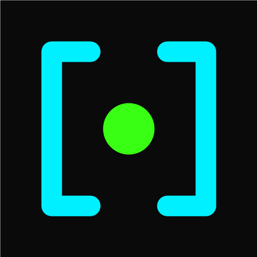
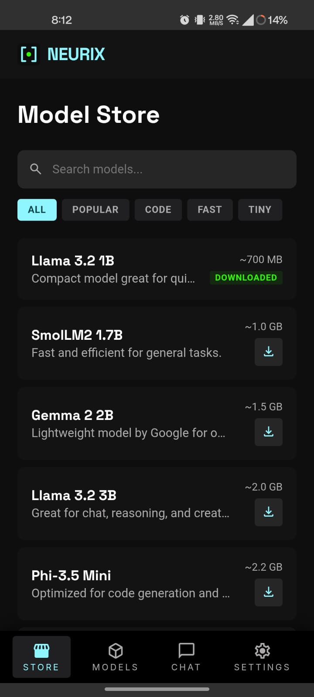
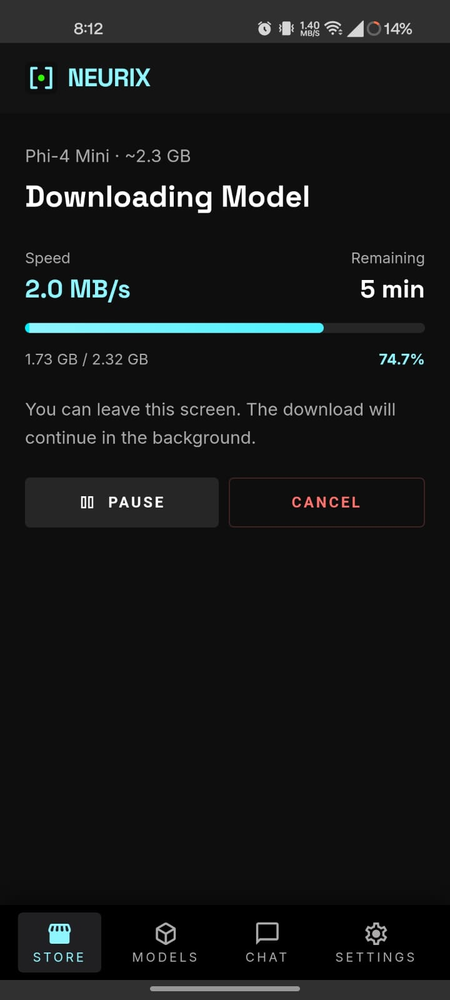
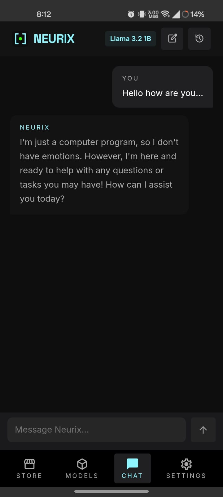
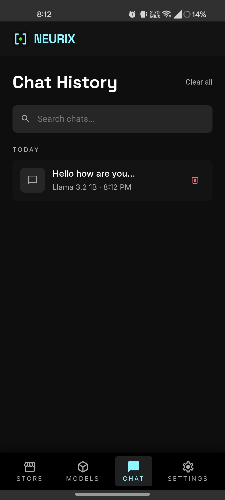
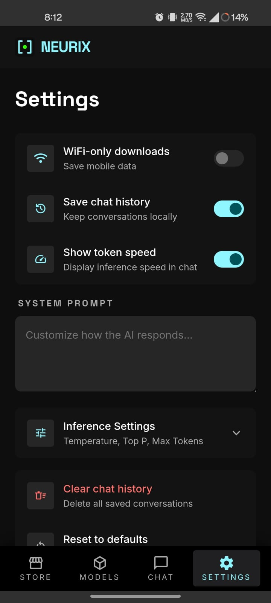
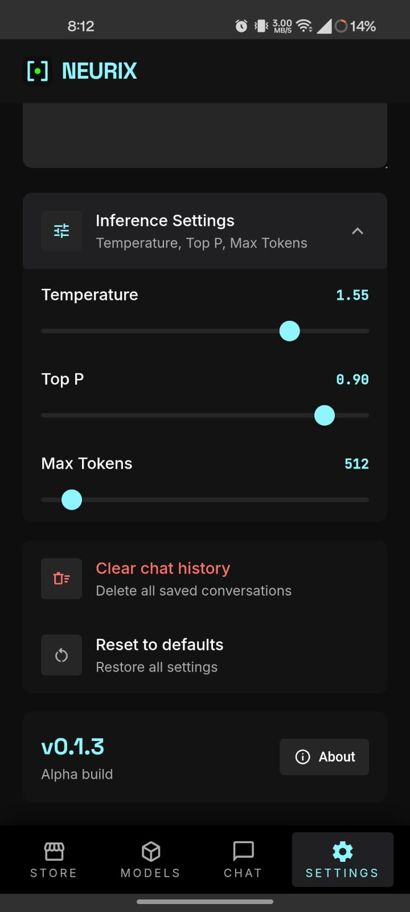

<div align="center">



# Neurix

**Your AI. Your phone. No cloud. No subscription. No limits.**

Run powerful language models directly on your device — fully offline, completely private.

[](https://github.com/Razee4315/neurix/releases)
[](https://github.com/Razee4315/neurix/actions)
[](LICENSE)
[](https://tauri.app)

**Android** · **Windows**

</div>

---

## The Story Behind Neurix

I'm from Skardu, a small town in the mountains of northern Pakistan. It's one of the most beautiful places on earth — surrounded by peaks, glaciers, and valleys that stretch for miles.

It's also a place where internet is a luxury, not a given.

When you drive out toward Deosai or up the road to Shigar, the signal drops. Sometimes for hours, sometimes for days. If you're trekking to a base camp or traveling through one of the many valleys, there is no connectivity at all. No cellular data, no Wi-Fi, nothing.

I relied on ChatGPT and Claude for everything — writing, coding, brainstorming, translating. But every time I left town, I lost access to all of it. And it's not just Skardu. Millions of people across remote regions — in the mountains, in rural areas, in places where infrastructure hasn't caught up — face the same problem. You're cut off from the tools that have become essential to how we work and think.

That's why I built Neurix.

Download a model once over Wi-Fi. Use it forever. On a bus through the Karakoram Highway, in a village with no cell tower, on a flight, or just somewhere you'd rather not send your conversations to someone else's server.

No account. No subscription. No data leaving your device. Just you and your AI.

---

## What It Does

Neurix runs large language models entirely on your phone or desktop. No server, no API calls, no internet required after the initial model download.

- Open the app, pick a model from the store, tap download
- Once downloaded, the model runs locally using your device's hardware
- Chat with it like any AI assistant — it just happens to be running on your phone

---

## Screenshots

<div align="center">
<table>
<tr>
<td align="center"><br /><b>Model Store</b></td>
<td align="center"><br /><b>Downloading</b></td>
</tr>
<tr>
<td align="center"><br /><b>Chat</b></td>
<td align="center"><br /><b>Chat History</b></td>
</tr>
<tr>
<td align="center"><br /><b>Settings</b></td>
<td align="center"><br /><b>Inference Settings</b></td>
</tr>
</table>
</div>

---

## Features

- **On-device inference** — AI runs on your CPU, no server involved
- **8 curated models** — from 380 MB to 2.2 GB, pick what fits your device
- **Offline after download** — use anywhere, anytime, no internet needed
- **Private by design** — conversations never leave your device
- **Model manager** — download, switch, delete models freely
- **Chat history** — searchable, auto-saved locally
- **System prompt** — customize how the AI responds
- **Inference controls** — temperature, top-p, max tokens
- **Resume downloads** — pause and continue where you left off
- **Built with Rust** — lightweight, fast, minimal memory footprint

## Available Models

| Model | Size | Best For |
|-------|------|----------|
| Qwen 2.5 0.5B | 380 MB | Ultra-fast, basic tasks |
| Llama 3.2 1B | 700 MB | Quick tasks and chat |
| Qwen 2.5 1.5B | 940 MB | Multilingual, reasoning |
| SmolLM2 1.7B | 1.0 GB | General purpose |
| Gemma 2 2B | 1.5 GB | On-device optimized |
| Qwen 2.5 3B | 1.8 GB | Complex tasks |
| Llama 3.2 3B | 2.0 GB | Chat, reasoning, writing |
| Phi-3.5 Mini | 2.2 GB | Code generation |

All models use Q4_K_M quantization for the best balance of quality and size.

---

## Installation

### Android

1. Download the `.apk` from [Releases](https://github.com/Razee4315/neurix/releases)
2. Enable **Install unknown apps** in your Android settings
3. Tap the APK to install
4. Open Neurix, download a model, and you're set

### Windows

Download the `.msi` (recommended) or `.exe` from [Releases](https://github.com/Razee4315/neurix/releases).

---

## Development

### Prerequisites

- Node.js 18+
- Rust 1.77+
- Tauri CLI v2
- Android SDK + NDK (for Android builds)

### Run Locally

```bash
git clone https://github.com/Razee4315/neurix.git
cd neurix
npm install
npx tauri dev
```

### Android

```bash
npm run android:init    # First time only
npm run tauri:android   # Run on device/emulator
```

### Build

```bash
npx tauri build             # Desktop
npm run build:android       # Android APK/AAB
```

### Commands

| Command | Description |
|---------|-------------|
| `npm run dev` | Vite dev server |
| `npx tauri dev` | Desktop app (dev mode) |
| `npm run tauri:android` | Android dev |
| `npm run build:android` | Android release build |
| `npm run lint` | Biome lint |
| `npm run format` | Biome format |
| `npm run test` | Run tests |

---

## Tech Stack

| Layer | Technology |
|-------|-----------|
| Framework | [Tauri 2.0](https://tauri.app) |
| Backend | Rust + [Candle](https://github.com/huggingface/candle) |
| Frontend | React 18 + TypeScript |
| Styling | styled-components |
| Inference | GGUF quantized models |
| Build | Vite |

Neurix is one of the first apps built with Tauri 2.0's mobile support. The Rust backend handles model loading and inference through Candle (HuggingFace's ML framework for Rust), while the React frontend provides the UI. This architecture keeps the app lightweight — the entire install is under 15 MB before models.

---

## Contributing

Contributions are welcome. See [CONTRIBUTING.md](CONTRIBUTING.md) for guidelines.

## Security

See [SECURITY.md](SECURITY.md) for our security policy and how to report vulnerabilities.

## License

MIT License. See [LICENSE](LICENSE) for details.

---

<div align="center">

Built by [Saqlain Razee](https://github.com/Razee4315)

</div>
